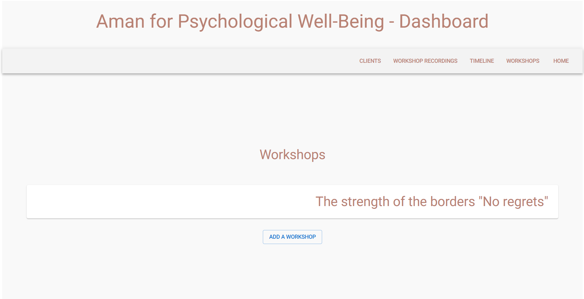
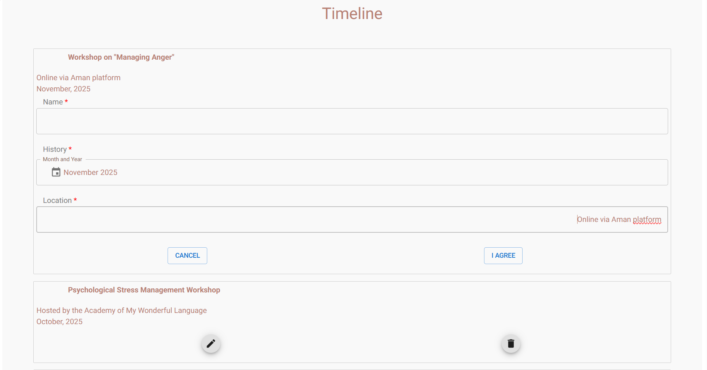
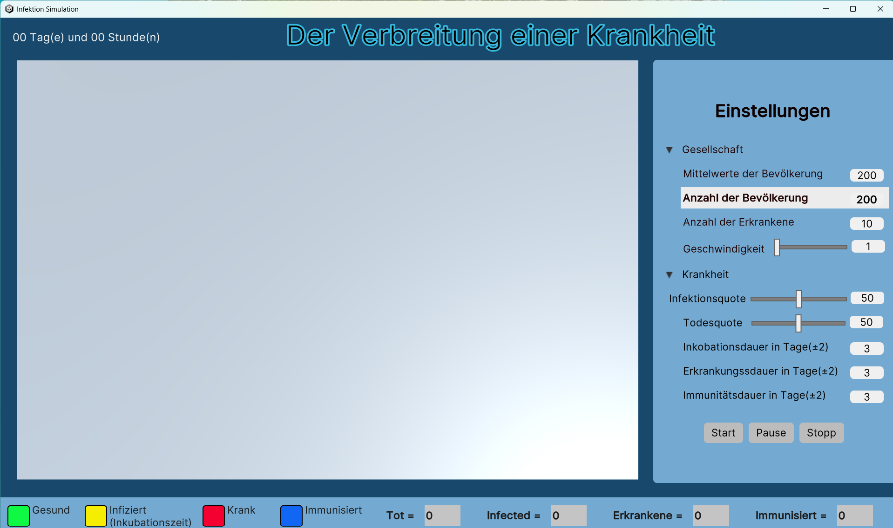

#  Lina Kurbeh – Softwareentwicklerin

Willkommen in meinem GitHub-Portfolio.  
Hier finden Sie ausgewählte Projekte, die meine praktischen Kenntnisse in der **Full-Stack-Webentwicklung** sowie in der **Simulation mit Unity (C#)** demonstrieren.

---

## 🚀 Full-Stack Websystem (Live)

**Beschreibung:**  
Entwicklung einer Webanwendung für eine **Physiotherapeutin** mit folgenden Funktionen:

- **Startseite** mit allgemeinen Informationen  
- **Timeline** mit allen vorherigen Workshops und Arbeitsstellen  
- **Kontaktseite** mit Kontaktdaten  
- **Workshop-Anmeldung ohne Account** mit **Online-Bezahlung über Stripe**  
- **Admin-Dashboard** zur Verwaltung von Workshops (hinzufügen, bearbeiten, entfernen) 

  

 

  

 

**Die Screenshots zeigen eine automatisch übersetzte Version des Admin-Dashboards, um die Inhalte verständlicher darzustellen.
*Da die arabische Sprache von rechts nach links gelesen wird (RTL), unterscheidet sich das Layout entsprechend.

- **Terminbuchung für einzelne Therapien** und **User-Accounts** (geplant / in Arbeit)

🌐 **Live-Demo:**  
[Zur Website](https://amancounselling.com)

🌍 **Sprache:**  
Die Benutzeroberfläche ist derzeit auf **Arabisch**, da sich das System an arabischsprachige Nutzer richtet.  
Eine **Mehrsprachigkeit (Deutsch / Englisch)** ist konzeptionell vorgesehen.

### 🛠 Technologien
**Frontend**
- Next.js, MUI, JavaScript / ES6+, responsives Design

**Backend**
- Node.js / Express
- RESTful APIs

**Datenbank**
- MongoDB

**Medienhosting**
- Cloudinary zur Verwaltung und zum Upload von Bildern

## 💳 Bezahlung
- Integration von **Stripe** zur Abwicklung von Online-Zahlungen (Live)  
- Umsetzung sicherer Zahlungsflüsse über das Backend  
- Verarbeitung von Zahlungsstatus und Events

**Weitere**
- Git & GitHub  
- Deployment / Hosting

### ✨ Funktionen
- Persistente Datenspeicherung  
- Strukturierte API-Architektur  
- Erweiterbare Systemstruktur  
- Admin-Dashboard mit CRUD-Funktionalität für Workshops  
- Workshop-Buchungen direkt im Frontend möglich

📈 **Projektstatus:**  
🟢 Aktiv in Entwicklung – neue Funktionen werden regelmäßig implementiert

---
## 🎮 Unity Simulation (C#)

**Beschreibung:**  
Entwicklung einer interaktiven **Simulation der Infektionsverbreitung in einer geschlossenen Gesellschaft**.  
Die Simulation nutzt **Zufallsverteilung, unterschiedliche Bewegungsgeschwindigkeiten** und visualisiert Prozesse in Echtzeit.  
Ziel war die **Umsetzung logischer Abläufe** sowie die **anschauliche Darstellung komplexer Zusammenhänge** mithilfe von Unity und C# im Rahmen der Ausbildung.

### 🛠 Technologien
- **Unity** (Engine für 3D-Simulationen)  
- **C#** (Skripting der Logik)  
- Physik- und Kollisionssysteme  
- 3D-Objekte und Szenen-Setup  

### ✨ Inhalte / Features
- Interaktionen zwischen Objekten (Kollisionen, Bewegungen)  
- Zustandslogik für simulierte Infektionsereignisse  
- **Simulation vereinfachter realer Abläufe**, um Dynamiken zu verstehen  
- Anpassbare Parameter (z. B. Geschwindigkeit, Infektionsrate)  

### 📸 Screenshot / Demo

  

  

---

## 🧩 Technische Kompetenzen
- Full-Stack Webentwicklung
- Backend-Architektur & APIs
- Datenbanken & Datenmodelle
- Objektorientierte Programmierung (C#, JavaScript)
- Versionskontrolle mit Git

---

## 📌 Hinweise
- Alle Projekte wurden eigenständig umgesetzt
- Fokus auf wartbaren, sauberen Code

---

📬 **Kontakt:**  
linak8694@gmail.com

Vielen Dank für Ihr Interesse.
